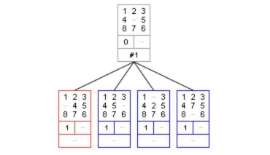
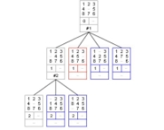

15 Puzzle Solver

I. Approach

In this project, I focus on the A\* Search and Greedy Search algorithms since Breadth First Search and Depth First Search are both inefficient for solving boards larger than 3x3.

1.1 A\* Search

A\* Search is an informed graph search approach that always chooses a possibly optimal choice out of other choices. In the N puzzle, ideal choices are based on a heuristic function. The heuristic value indicates the estimated steps to solve the game. The cost value indicates the step moved so far. By adding them together, value f is generated. This method generates a shorter solution than Greedy Search, but the memory cost is much larger than Greedy Search since there are more states needed to explore. This method is inefficient to solve or unable to solve complex boards like 5x5 or above.

1.2 Greedy Search

This approach is similar to A\* Search except it does not take the number of moves into count. By using this approach, all the boards up to 6x6 can be solved within a second. The algorithm always explores the state with the least estimated distance to the target. Therefore, the solution is always not optimal. But the memory it used should be significant less than the original A\* Search.

1.3 Fringe First Approach

The idea of this method is to solve the row and column by greedy search and reduce the board to (N-1)x(N-1) or iterate to become an even smaller board. But when I attempted this approach, there was a large amount of useless board expended using Manhattan distance as heuristic(fringe tiles hard to interact with the blank space). I give up on this approach after several tries on the heuristic, but I believe an ideal heuristic value can make this approach workable.

1.4 Heuristic

In this project, there are four heuristic have been used:

- Hamming distance: the number of tiles that are out of place.
- Manhattan distance: sum of horizontal and vertical distance for each tile out of place.
- Euclidean distance: sum of straight-line distance for each tile out of place. For example, if tile 1 current position is (x, y), and its target position is (0, 0) , the euclidean distance will be sqrt((x-0)^2 +( y-0)^2).
- Linear conflict: Linear conflict occurs when two tiles are in the same row or column, and their target place is also in the same row or column, but they are in the wrong order. It adds 2 for each linear conflict in the state.

II. Data Structure

2.1 Board Translator

The board translator takes a txt file with an initial state as an input and generates a 2D array version of it as an output.

2.2 AStarNode

In AStarNode, I store the required information of the state. The parameters are shown below:

- state: the current state of the board.
- size: the row/column length of the board.
- parent: saves the parent node that indicates the previous step.
- h: heuristic value of the current state.
- lastMove: the move to perform that led to the current state (I store it as an ArrayList, tile number in index 0, move direction in index 1).

2.3 minHeapPriorityQ and Wrapper

I implement a priority queue called minHeapPriorityQ that allows the program to store the AStarNode and sort them based on their f value or heuristic value. This class will be used as an open list.

In the Wrapper class, I override the hashCode() function using Arrays.deepHashCode(state) where state is the 2D array. The purpose of it is to compare to see whether the two states are the same.

2.4 A\* Search Algorithm

In the solver method, the initial state is the input. While the solver is running, two lists are maintained. The first one is an open list that is defined as a priority queue. The open list is used to keep track of states that have been discovered but not yet explored. The second one is the closed list, which is used to keep track of states that have been explored. In order to start exploring, we put the initial node with an initial state into the open list.

While the open list is not empty, the solver will keep iterating or stop when the current node contains the state that matches the target. As figure1 and figure2 shown, the current node being explored should be marked as discovered and explored and added to the closed list. When the state of the node does not match the target, the program expands the current node to more nodes, each node containing a state that moves a blank space by one step. And add those nodes into the open list except if that state is already present in the closed list.

 

Figure1. first iteration of node expand Figure2. second iteration of node expand

When the node contains a target state that is found, we iterate the node back to the initial node by calling its parent. While iterating, we add the last move stored in every node to an ArrayList. Finally, we iterate the ArrayList and write all the steps to solve the game to a txt file.

III. Challenge

The problem mostly encountered is out of memory error. In order to improve the solver to save memory, I used byte instead of int to present the state in the node. However, the improvement is not enough to solve all the 7x7 boards when using greedy search.

After trying the fringe first approach, I focus on defining a more ideal heuristic other than Manhattan distance. After numerous attempts, I found out that combining Manhattan distance, Linear conflict, Hamming distance, and Euclidean distance together and applying different weights on them can solve all the boards up to 8x8. The heuristic function I am using is Manhattan/2 + Euclidean/2 + Hamming + linearConflict.

IV. Conclusion

The board size and its randomization is positively correlated to the running time and the memory usage. Finding an optimal solution for large boards is difficult. An ideal heuristic is the key to solving large boards.
